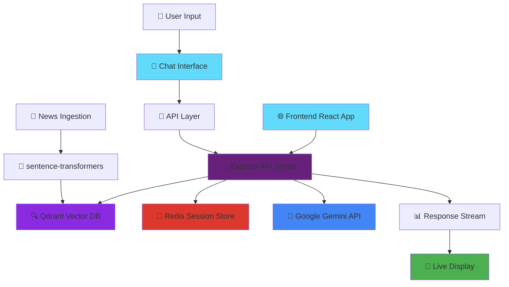

<div align="center">


**🔥 Intelligent News Retrieval System powered by RAG Architecture**

*Complete full-stack solution with semantic search and conversational AI*

[🚀 Quick Start](#-quickstart) • [📖 API Docs](#-api-endpoints) • [⚡ Features](#-features) • [🏗️ Architecture](#️-architecture)

</div>

---

## 📋 Table of Contents

1. [🏗️ System Architecture](#️-system-architecture)
2. [✨ Features Overview](#-features-overview)
3. [🛠️ Tech Stack](#️-tech-stack)
4. [🚀 Quick Start Guide](#-quick-start-guide)
5. [🔧 Backend Documentation](#-backend-documentation)
6. [🌟 Frontend Documentation](#-frontend-documentation)
7. [🚀 Deployment](#-deployment)
8. [🔧 Troubleshooting](#-troubleshooting)
9. [🤝 Contributing](#-contributing)

---

## 🏗️ System Architecture



## ✨ Features Overview

### 🔙 Backend Features
🧠 **Smart Retrieval** - Semantic search using sentence-transformers embeddings  
💬 **Conversational AI** - Google Gemini-powered chat interface  
⚡ **Real-time Streaming** - Server-Sent Events for live responses  
🗄️ **Session Memory** - Redis-backed conversation history  
🌐 **Production Ready** - Optimized for Render deployment  
📊 **Vector Search** - Qdrant Cloud integration for lightning-fast queries  

### 🎨 Frontend Features
🎯 **Intelligent Chat Interface** - Clean, modern conversation UI  
⚡ **Real-time Streaming** - Live token-by-token response display  
📱 **Responsive Design** - Perfect on desktop, tablet, and mobile  
🗂️ **Session Management** - Persistent conversation history  
📄 **Source Citations** - View retrieved documents and sources  
🌙 **Modern UX** - Smooth animations and intuitive interactions  
🔄 **Auto-reconnect** - Robust connection handling for streaming  

## 🛠️ Tech Stack

### Backend Stack
| Component | Technology | Purpose |
|-----------|------------|---------|
| **🔤 Embeddings** | `sentence-transformers/all-MiniLM-L6-v2` | Fast, lightweight semantic encoding |
| **🗄️ Vector DB** | `Qdrant Cloud` | Managed vector storage & similarity search |
| **🤖 LLM API** | `Google Gemini API` | Advanced language understanding |
| **⚙️ Backend** | `Node.js + Express` | RESTful API server |
| **💾 Caching** | `Redis (ioredis)` | Session history & performance |
| **🚀 Deployment** | `Render` | Scalable cloud hosting |

### Frontend Stack
| Component | Technology | Purpose |
|-----------|------------|---------|
| **⚛️ Framework** | `React 18` | Modern UI library with hooks |
| **⚡ Build Tool** | `Vite` | Lightning-fast development & builds |
| **🎨 Styling** | `Tailwind CSS` | Utility-first CSS framework |
| **📡 API Client** | `Fetch API + SSE` | REST calls & real-time streaming |
| **📱 Responsive** | `CSS Grid + Flexbox` | Mobile-first responsive design |
| **🚀 Deployment** | `Vercel` | Edge-optimized static hosting |

---

## 🚀 Quick Start Guide

### 📋 Prerequisites

- Node.js 18+ 
- Redis instance (local or Upstash)
- Qdrant Cloud account
- Google Gemini API key

### ⚡ Full System Setup

```bash
# 1. Clone repositories
git clone <backend-repo-url>
git clone <frontend-repo-url>

# 2. Setup Backend
cd rag-news-backend
npm install
cp .env.example .env
# Edit .env with your credentials

# 3. Setup Frontend
cd ../rag-news-frontend
npm install
```

### 🔧 Environment Configuration

#### Backend `.env`
```env
# 🚀 Server Configuration
PORT=4000

# 💾 Redis Configuration  
REDIS_URL=redis://localhost:6379

# 🗄️ Qdrant Configuration
QDRANT_URL=https://your-cluster.qdrant.cloud
QDRANT_API_KEY=your_qdrant_api_key
QDRANT_COLLECTION=news_embeddings

# 🤖 Google Gemini Configuration
GEMINI_API_URL=https://api.studio.googlecloud.ai/your-endpoint
GEMINI_API_KEY=your_gemini_api_key

# ⏱️ Session Configuration
SESSION_TTL_SECONDS=86400
```

#### Frontend `.env.local`
```env
# 🌐 Backend API Configuration
VITE_API_URL=http://localhost:4000/api
```

### 🏃‍♂️ Running the System

```bash
# Terminal 1: Start Backend
cd rag-news-backend
npm run dev

# Terminal 2: Start Frontend
cd rag-news-frontend
npm run dev

# Terminal 3: Ingest News Data
cd rag-news-backend/scripts
pip install -r requirements.txt
python ingest_news.py --limit 50
```

---

## 🔧 Backend Documentation

### 📰 News Ingestion

Populate your vector database with news articles:

```bash
# Navigate to scripts directory
cd scripts

# Install Python dependencies
pip install -r requirements.txt

# Ingest news articles (adjust limit as needed)
python ingest_news.py --limit 50
```

This script will:
- 📥 Fetch news articles from configured sources
- 🔄 Generate embeddings using sentence-transformers
- 💾 Store vectors in Qdrant Cloud
- ✅ Create the collection if it doesn't exist

### 📖 API Endpoints

#### 💬 Chat Endpoints

##### `POST /api/chat`
Start or continue a conversation

```bash
curl -X POST https://your-backend.com/api/chat \
  -H "Content-Type: application/json" \
  -d '{
    "message": "What are the latest developments in AI?",
    "sessionId": "optional-session-id"
  }'
```

**Response:**
```json
{
  "sessionId": "unique-session-id",
  "reply": "Based on recent articles, here are the key AI developments...",
  "retrieved": [
    {
      "title": "Article Title",
      "content": "Article snippet...",
      "score": 0.85
    }
  ]
}
```

##### `POST /api/chat/stream`
Stream responses in real-time using Server-Sent Events

```bash
curl -X POST https://your-backend.com/api/chat/stream \
  -H "Content-Type: application/json" \
  -d '{"message": "Tell me about renewable energy", "sessionId": "session-123"}'
```

#### 🗂️ Session Management

##### `GET /api/session/:sessionId/history`
Retrieve conversation history

```bash
curl https://your-backend.com/api/session/session-123/history
```

##### `POST /api/session/:sessionId/clear`
Clear session history

```bash
curl -X POST https://your-backend.com/api/session/session-123/clear
```

#### 💚 Health Check

##### `GET /api/health`
Check server status

```bash
curl https://your-backend.com/api/health
```

### 🔧 PowerShell Usage Notes

When testing with PowerShell, use proper escaping:

```powershell
# Method 1: Use curl.exe with stop-parsing
curl.exe --% -X POST -H "Content-Type: application/json" -d "{\"message\":\"hello\"}" "https://your-backend.com/api/chat"

# Method 2: Use single quotes for JSON
curl -X POST -H 'Content-Type: application/json' -d '{"message":"hello"}' 'https://your-backend.com/api/chat'
```

---

## 🌟 Frontend Documentation

### 💬 Chat Interface Features

#### 🎯 Core Functionality

- **💭 Natural Conversations** - Type questions in natural language
- **⚡ Streaming Responses** - Watch answers appear in real-time
- **📄 Source Display** - See retrieved articles and relevance scores
- **🔄 Session Continuity** - Conversations persist across page reloads

#### 🎨 User Experience

- **🌊 Smooth Animations** - Typing indicators and message transitions
- **📱 Mobile Optimized** - Touch-friendly interface for all devices
- **♿ Accessibility** - ARIA labels and keyboard navigation
- **🎭 Loading States** - Clear feedback during processing

### 📋 API Integration

#### 🔗 Backend Communication

The frontend communicates with the RAG News Backend through:

```javascript
// Chat with streaming response
POST /api/chat/stream
{
  "message": "What's happening in tech?",
  "sessionId": "optional-session-id"
}

// Save conversation and get sources
POST /api/chat
{
  "message": "User message",
  "sessionId": "session-123"
}

// Retrieve conversation history
GET /api/session/{sessionId}/history

// Clear conversation
POST /api/session/{sessionId}/clear
```

#### 📊 Response Handling

```javascript
// Streaming response format (SSE)
data: {"token": "The", "done": false}
data: {"token": " latest", "done": false}
data: {"sessionId": "123", "done": true}

// Regular response format
{
  "sessionId": "unique-session-id",
  "reply": "Complete response text",
  "retrieved": [
    {
      "title": "Article Title",
      "content": "Relevant excerpt...",
      "score": 0.87
    }
  ]
}
```

### 🎨 Component Architecture

```
src/
├── 📁 components/
│   ├── 💬 ChatInterface/
│   │   ├── ChatContainer.jsx
│   │   ├── MessageList.jsx
│   │   ├── MessageInput.jsx
│   │   └── TypingIndicator.jsx
│   ├── 📄 SourcePanel/
│   │   ├── SourceList.jsx
│   │   └── SourceCard.jsx
│   └── 🔧 Common/
│       ├── LoadingSpinner.jsx
│       └── ErrorBoundary.jsx
├── 📁 services/
│   ├── api.js          # API client functions
│   └── streaming.js    # SSE handling
├── 📁 styles/
│   ├── main.scss       # Global styles
│   ├── variables.scss  # Design tokens
│   └── components/     # Component-specific styles
└── 📁 utils/
    ├── sessionStorage.js
    └── formatters.js
```

---

## 🚀 Deployment

### 🌐 Backend Deployment (Render)

1. **🔗 Connect Repository** - Link your GitHub repo to Render
2. **⚙️ Environment Variables** - Add all `.env` variables to Render dashboard
3. **🏗️ Build Settings:**
   ```
   Build Command: npm install
   Start Command: npm start
   ```

### 🌐 Frontend Deployment (Vercel)

1. **🔗 Connect Repository**
   ```bash
   # Push your code to GitHub
   git add .
   git commit -m "feat: add RAG news frontend"
   git push origin main
   ```

2. **⚙️ Vercel Setup**
   - Connect your GitHub repo to Vercel
   - Framework preset: **Vite**
   - Build command: `npm run build`
   - Output directory: `dist`

3. **🔧 Environment Variables**
   In Vercel dashboard → Settings → Environment Variables:
   ```
   VITE_API_URL = https://your-backend.onrender.com/api
   ```

4. **🚀 Deploy**
   - Vercel will auto-deploy on every push to main
   - Your app will be available at `https://your-app.vercel.app`

### 📦 Docker Support

#### Backend Dockerfile
```dockerfile
FROM node:18-alpine
WORKDIR /app
COPY package*.json ./
RUN npm ci --only=production
COPY . .
EXPOSE 4000
CMD ["npm", "start"]
```

#### Frontend Dockerfile
```dockerfile
FROM node:18-alpine as builder
WORKDIR /app
COPY package*.json ./
RUN npm ci
COPY . .
RUN npm run build

FROM nginx:alpine
COPY --from=builder /app/dist /usr/share/nginx/html
COPY nginx.conf /etc/nginx/nginx.conf
EXPOSE 80
CMD ["nginx", "-g", "daemon off;"]
```

---

## 🔧 Troubleshooting

### 🚨 Common Issues

#### ❌ "Failed to fetch" Errors
```bash
# Check your backend URL in .env.local
VITE_API_URL=https://your-backend.onrender.com/api  # ✅ Correct
VITE_API_URL=https://your-backend.onrender.com      # ❌ Missing /api
```

#### 🔄 Streaming Not Working
- Verify your backend supports Server-Sent Events
- Check browser network tab for connection errors
- Ensure CORS is configured on your backend

#### 📊 Vector Search Issues
- Verify Qdrant collection exists and has data
- Check embedding model consistency between ingestion and search
- Confirm API keys and URLs are correct

#### 🌐 Deployment Issues
- Confirm `VITE_API_URL` points to your deployed backend
- Verify backend CORS allows your frontend domain
- Check browser console for specific error messages

### 🐛 Debug Commands

```bash
# Check backend health
curl https://your-backend.com/api/health

# Verify Qdrant collection
curl -X POST -H "api-key: YOUR_KEY" \
  -H "Content-Type: application/json" \
  -d "{}" \
  "https://your-qdrant-host/collections/news_embeddings/points/count"

# Test chat endpoint
curl -X POST -H "Content-Type: application/json" \
  -d '{"message": "test"}' \
  "https://your-backend.com/api/chat"
```

### 📊 Performance Optimization

- 🚀 **Redis Optimization**: Use connection pooling
- 💾 **Qdrant Tuning**: Optimize vector dimensions
- ⚡ **Caching Strategy**: Implement smart cache invalidation
- 🔄 **Load Balancing**: Use multiple instances for scale

---

## 🔒 Security Notes

- ⚠️ **Never commit `.env` files** - Add to `.gitignore`
- 🔐 Use environment variables for all secrets
- 🌐 Configure CORS for your frontend domain
- 🛡️ Implement rate limiting for production
- 🔑 Rotate API keys regularly

---

## 🧪 Testing

### Backend Testing
```bash
# Run unit tests
npm test

# Run integration tests
npm run test:integration

# Test with coverage
npm run test:coverage
```

### Frontend Testing
```bash
# Run unit tests
npm run test

# Run tests with coverage
npm run test:coverage

# E2E testing with Playwright
npm run test:e2e
```

---

## 🎯 Feature Roadmap

### Backend Enhancements
- 🔍 **Advanced Filtering** - Date, source, category filters
- 📊 **Analytics API** - Usage metrics and insights
- 🔄 **Batch Processing** - Bulk news ingestion
- 🌍 **Multi-language** - Support for non-English content

### Frontend Enhancements
- 🌙 **Dark Mode Toggle** - Theme switching capability
- 🔖 **Bookmarking** - Save favorite conversations
- 📤 **Export Options** - Download conversations as PDF/markdown
- 🌍 **Internationalization** - Multi-language support

---

## 🤝 Contributing

1. Fork the repository
2. Create a feature branch: `git checkout -b feature/amazing-feature`
3. Follow the coding standards and add tests
4. Commit changes: `git commit -m 'Add amazing feature'`
5. Push to branch: `git push origin feature/amazing-feature`
6. Open a Pull Request

### Development Guidelines

- Follow existing code style and patterns
- Add tests for new functionality
- Update documentation for API changes
- Ensure mobile responsiveness for UI changes
- Test across different browsers and devices

---


---

